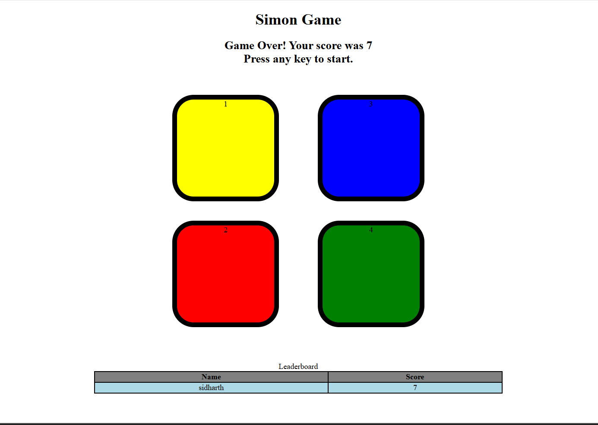

# Simon Says Game

## Overview
This is an interactive Simon Says game built using HTML, CSS, and JavaScript. The game challenges players to repeat a sequence of colors generated by the system, increasing in difficulty with each level. It includes a leaderboard to track top scores.

## Purpose
- **Learn Game Development**: Gain experience in creating a simple browser-based game.
- **Enhance JavaScript Skills**: Implement logic for sequence generation, user input, and score tracking.
- **Practice CSS Styling**: Design a visually appealing interface with color-based buttons and responsive elements.

## Features
- **Color Sequence Game**: Players must replicate the random color sequence displayed by the game.
- **Level Progression**: Increases difficulty with each correct sequence.
- **Flash Effects**: Visual feedback with white and aqua flashes for game and user actions.
- **Leaderboard**: Tracks and displays the top 5 scores with player names.
- **Game Reset**: Allows restarting after a game over with any key press.

## Folder Structure
simon_game/
├── index.html          # Main HTML file
├── simon.css           # Main stylesheet
└── simon.js            # JavaScript logic

 

## Technologies Used
- **HTML5**: For structure and semantic markup.
- **CSS3**: For styling, including Flexbox and custom button designs.
- **JavaScript**: For game logic, event handling, and dynamic updates.

## How to Play
1. Press any key to start the game.
2. Watch the sequence of flashing colors (red, yellow, green, blue).
3. Click the buttons in the same order as the sequence.
4. Continue as the sequence length increases with each level.
5. Game over if you miss a sequence—enter your name to save your score on the leaderboard.
6. Press any key to restart.

## Installation
1. Clone the repository: `git clone <your-repo-url>/simon_game.git`
2. Navigate to the project folder: `cd simon_game`
3. Open `index.html` in a web browser to play the game.

## Future Improvements
- **Sound Effects**: Add audio cues for each color.
- **Multiplayer Mode**: Allow competition between players.
- **Persistent Leaderboard**: Save scores locally or via a backend.
- **Responsive Design**: Optimize for mobile devices.

## Connect with Me
If you enjoyed this project or want to collaborate:
- **GitHub**: [sidharthcodes-arch](https://github.com/sidharthcodes-arch)

## Acknowledgments
- Inspired by the classic Simon Says game.
- Thanks to Apna College for guidance in building this project.

## Support
If you find this project useful, please consider starring the repository! ⭐